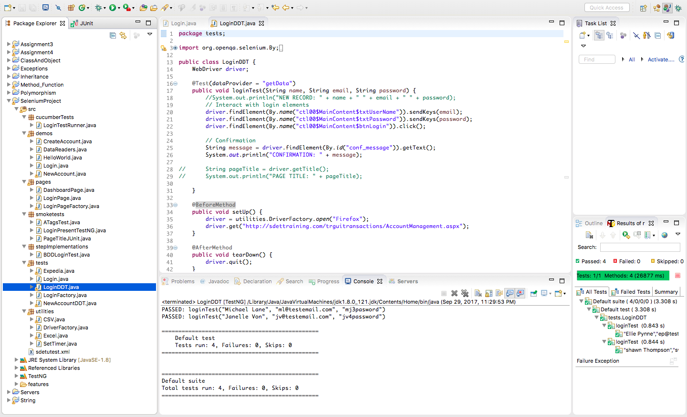
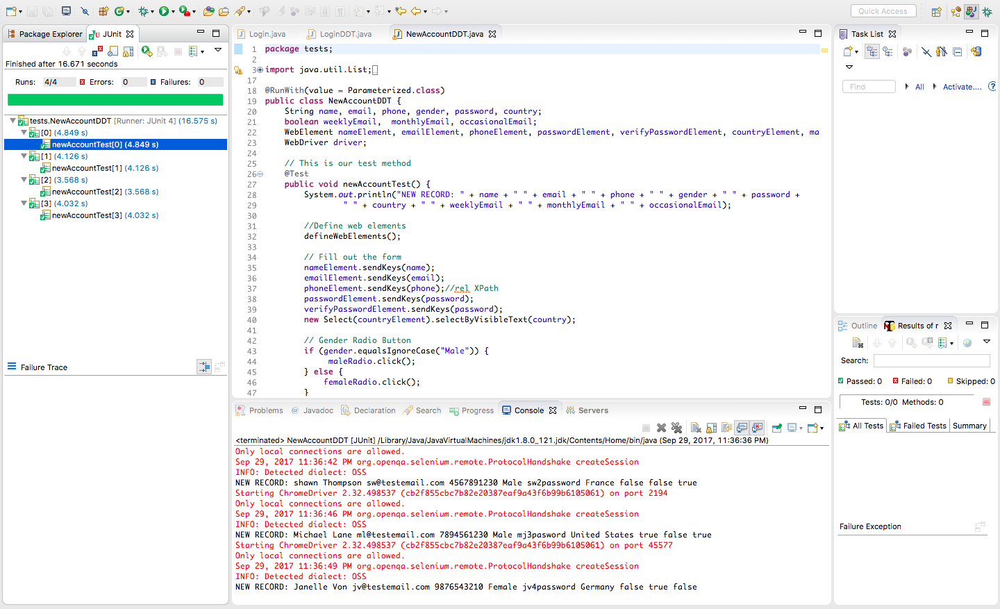
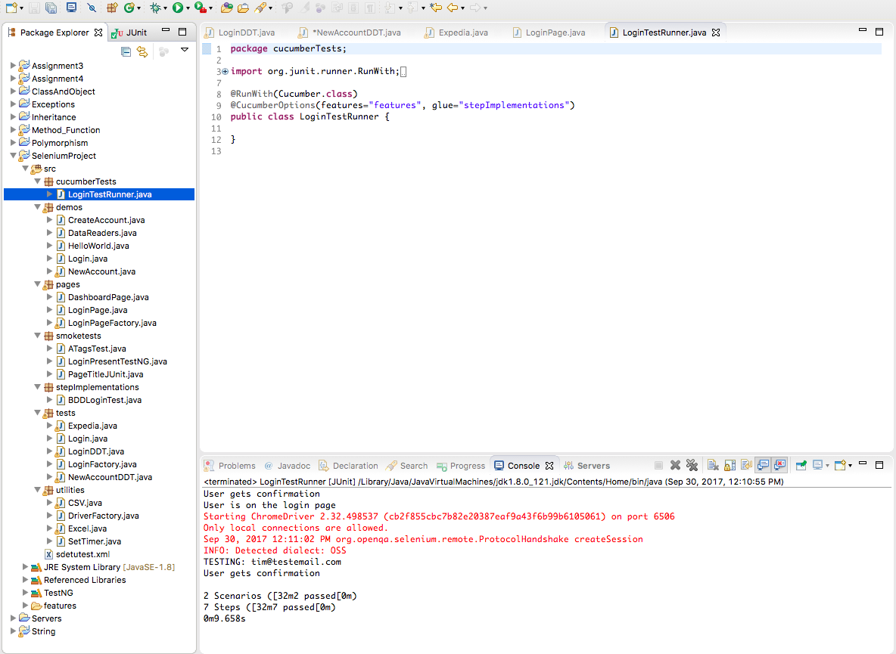
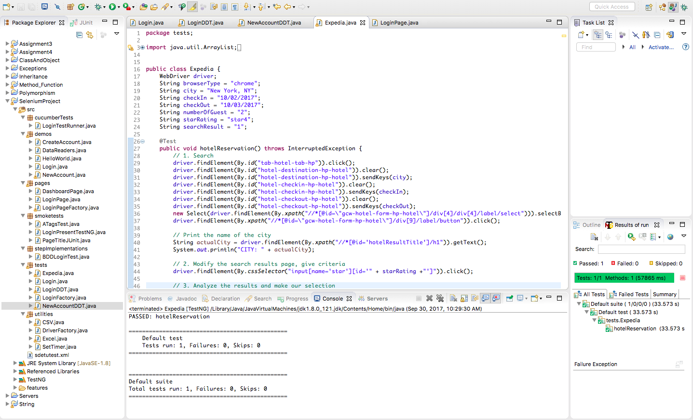

# Build Selenium Automation Tool with Java  

This Selenium automataion tool is for testing the project browser served in the same folder.  
Login Test Page: http://sdettraining.com/trguitransactions/AccountManagement.aspx
New Account Test Page: http://sdettraining.com/trguitransactions/NewAccount.aspx

### Required Skills: Selenium, Java, JUnit, TestNG, Cucumber 

## Images In ReadMes
### Login test 

### New Account test 

### Test for the same browser using Cucumber  

### Expedia test 
